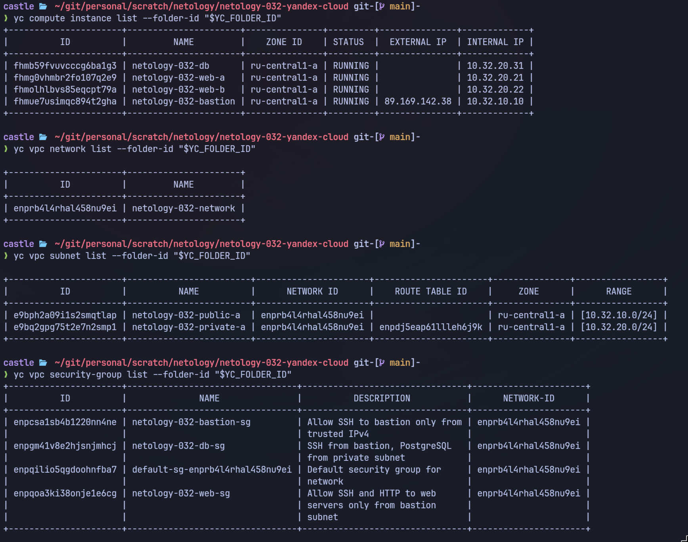
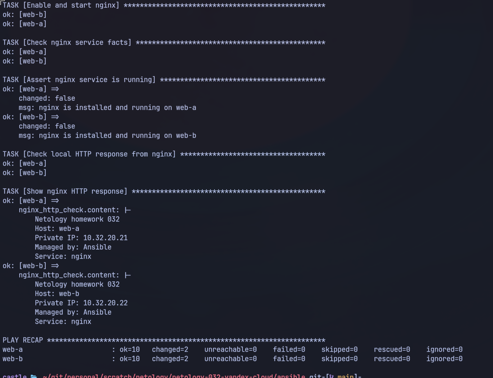
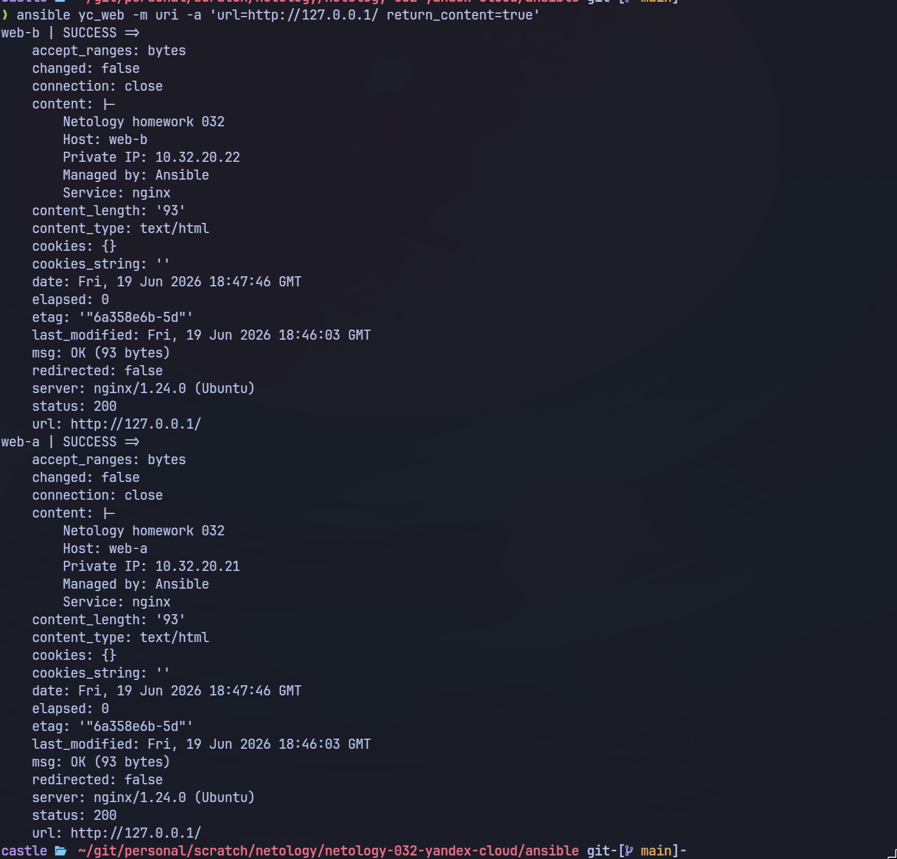
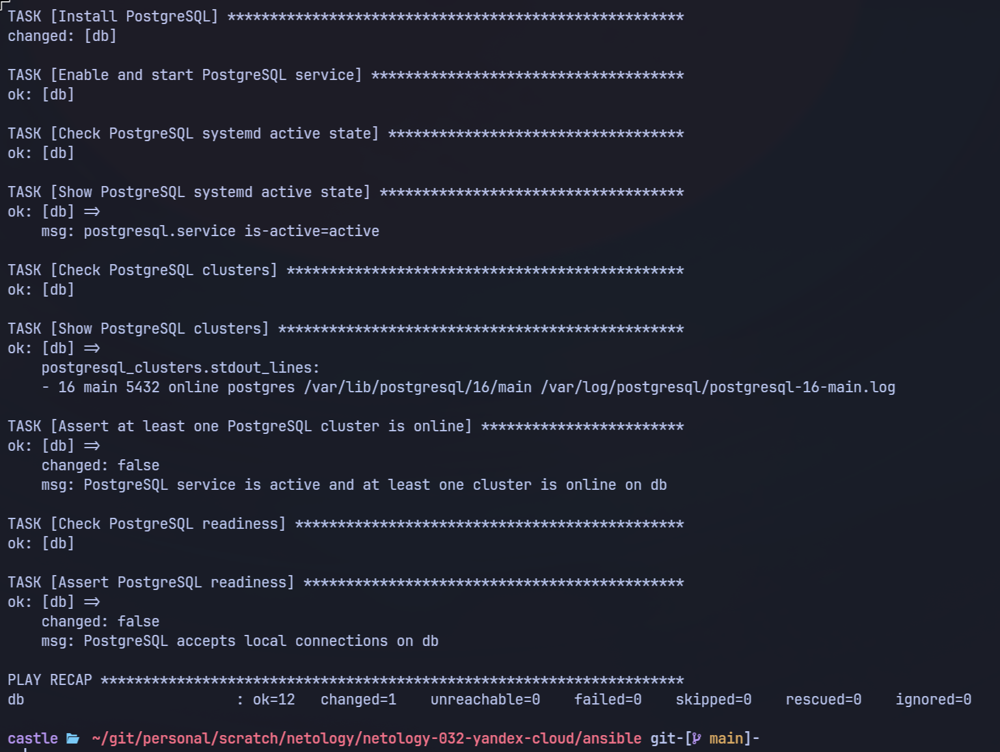
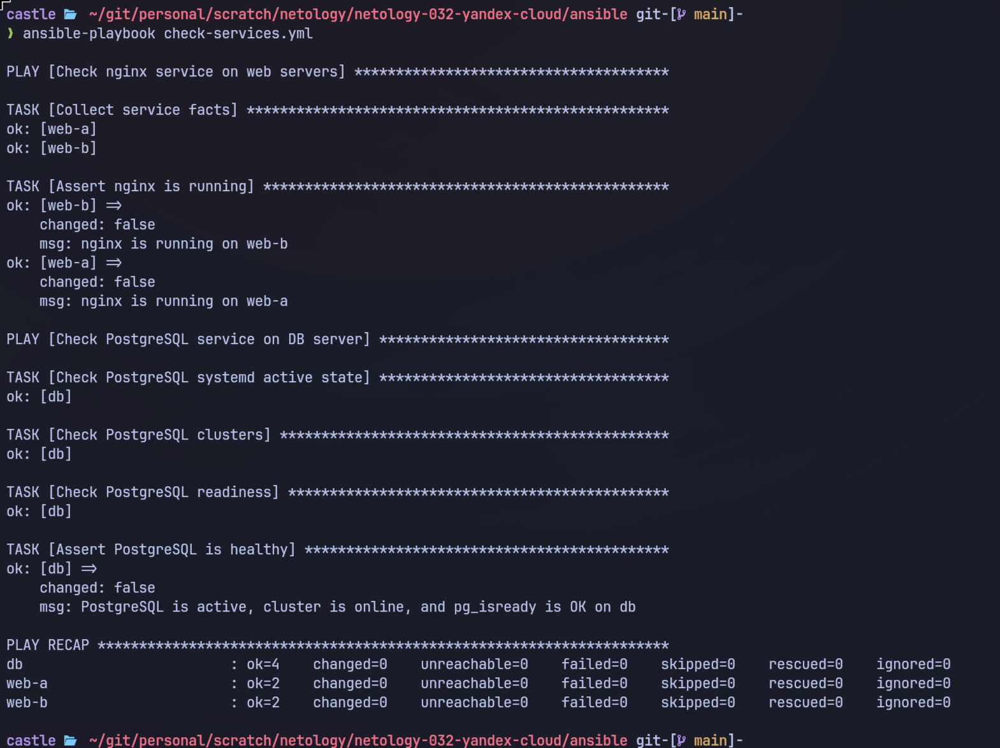
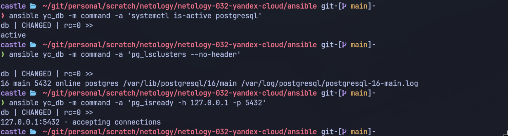

# Домашнее задание к занятию «Подъём инфраструктуры в Yandex Cloud»

Студент: Игорь Мосиичук

## Что сделано

Поднята учебная инфраструктура в Yandex Cloud через Terraform и настроена через Ansible.

Коротко:

* создана VPC с public/private subnet;
* `bastion` вынесен в public subnet;
* `web-a`, `web-b` и `db` размещены в private subnet без public IP;
* private VM выходят в интернет через NAT gateway;
* доступ к private VM идёт через SSH ProxyJump через bastion;
* на `web-a` и `web-b` установлен nginx;
* на `db` установлен PostgreSQL;
* состояние сервисов проверяется через Ansible;
* YC token не хранится в Terraform-коде и передаётся через environment.

## Структура

```text
.
├── README.md
├── ansible/
│   ├── ansible.cfg
│   ├── check-services.yml
│   ├── install-nginx.yml
│   └── install-postgresql.yml
├── docs/
│   ├── README_clear-lab-known-hosts.sh.md
│   ├── README_export-yc-env.zsh.md
│   └── README_render-inventory.sh.md
├── scripts/
│   ├── clear-lab-known-hosts.sh
│   ├── export-yc-env.zsh
│   └── render-inventory.sh
└── terraform/
    ├── .terraform.lock.hcl
    ├── ansible_outputs.tf
    ├── cloud-init.yml
    ├── compute.tf
    ├── network.tf
    ├── outputs.tf
    ├── providers.tf
    ├── variables.tf
    └── versions.tf
```

`ansible/inventory.yml`, `artifacts/`, `terraform.tfstate`, `*.tfvars`, `.terraformrc`, `tfplan` и `tfdestroy` в репозиторий не добавляются.

## Схема

```text
workstation
    |
    | SSH
    v
bastion
public IP: выдаёт Yandex Cloud
private IP: 10.32.10.10
    |
    | SSH ProxyJump
    v
private subnet 10.32.20.0/24
    |
    |-- web-a: 10.32.20.21, nginx
    |-- web-b: 10.32.20.22, nginx
    |-- db:    10.32.20.31, PostgreSQL
```

Bastion остаётся единственной публичной VM. Web и DB закрыты в private subnet. Для установки пакетов на private VM используется NAT gateway.

## Задание 1

<details>
<summary>Условие</summary>

Повторить демонстрацию лекции: развернуть VPC, 2 web-сервера и bastion-сервер.

</details>

### Решение

Terraform создаёт сеть, подсети, NAT gateway, route table, security groups и VM.

VM описаны одним ресурсом `yandex_compute_instance.vm` через `for_each`. Для каждой машины отдельно задаётся роль, hostname, subnet, IP и security group.

Основные параметры VM:

```text
platform_id   = standard-v2
cores         = 2
memory        = 1 GB
core_fraction = 5
disk_size     = 10 GB
disk_type     = network-hdd
preemptible   = true
```

Файлы:

* [terraform/providers.tf](terraform/providers.tf)
* [terraform/versions.tf](terraform/versions.tf)
* [terraform/variables.tf](terraform/variables.tf)
* [terraform/network.tf](terraform/network.tf)
* [terraform/compute.tf](terraform/compute.tf)
* [terraform/cloud-init.yml](terraform/cloud-init.yml)
* [terraform/outputs.tf](terraform/outputs.tf)
* [terraform/ansible_outputs.tf](terraform/ansible_outputs.tf)

Запуск:

```bash
source scripts/export-yc-env.zsh

terraform -chdir=terraform init
terraform -chdir=terraform fmt -recursive -check
terraform -chdir=terraform validate
terraform -chdir=terraform plan -out=tfplan
terraform -chdir=terraform apply tfplan
```

Результат финального apply:

```text
Apply complete! Resources: 12 added, 0 changed, 0 destroyed.
```

Проверка через CLI:

```bash
yc compute instance list --folder-id "$YC_FOLDER_ID"
yc vpc network list --folder-id "$YC_FOLDER_ID"
yc vpc subnet list --folder-id "$YC_FOLDER_ID"
yc vpc security-group list --folder-id "$YC_FOLDER_ID"
```

Ожидаемый результат:

```text
netology-032-bastion RUNNING, public IP есть, internal IP 10.32.10.10
netology-032-web-a   RUNNING, public IP нет, internal IP 10.32.20.21
netology-032-web-b   RUNNING, public IP нет, internal IP 10.32.20.22
netology-032-db      RUNNING, public IP нет, internal IP 10.32.20.31
```

Скриншот:




## Задание 2

<details>
<summary>Условие</summary>

С помощью Ansible подключиться к `web-a` и `web-b`, установить на них nginx. Написать Ansible playbook, провести тестирование и приложить скриншоты развернутых VM и успешно отработавшего Ansible playbook.

</details>

### Решение

Terraform отдаёт output `ansible_inventory`. После apply из него генерируется `ansible/inventory.yml`:

```bash
./scripts/render-inventory.sh
```

В inventory есть группы:

```text
yc_bastion
yc_web
yc_db
```

Для private VM используется `ProxyJump` через bastion.

nginx ставится playbook-ом [ansible/install-nginx.yml](ansible/install-nginx.yml). Playbook обновляет apt cache, ставит nginx, создаёт простую index page, запускает сервис и проверяет HTTP-ответ.

Файлы:

* [ansible/ansible.cfg](ansible/ansible.cfg)
* [ansible/install-nginx.yml](ansible/install-nginx.yml)
* [scripts/render-inventory.sh](scripts/render-inventory.sh)
* [terraform/ansible_outputs.tf](terraform/ansible_outputs.tf)

Команды:

```bash
./scripts/render-inventory.sh

cd ansible
ansible-inventory --graph

ansible yc_bastion -m ping
ansible all -m command -a 'cloud-init status --wait'
ansible all -m ping

ansible-playbook install-nginx.yml --diff
```

Inventory graph:

```text
@all:
  |--@ungrouped:
  |--@yc_bastion:
  |  |--bastion
  |--@yc_db:
  |  |--db
  |--@yc_web:
  |  |--web-a
  |  |--web-b
```

Результат `install-nginx.yml`:

```text
PLAY RECAP
web-a : ok=10 changed=2 unreachable=0 failed=0 skipped=0 rescued=0 ignored=0
web-b : ok=10 changed=2 unreachable=0 failed=0 skipped=0 rescued=0 ignored=0
```

Проверка HTTP:

```bash
ansible yc_web -m uri -a 'url=http://127.0.0.1/ return_content=true'
```

Результат:

```text
web-a: status 200, server nginx/1.24.0 (Ubuntu)
web-b: status 200, server nginx/1.24.0 (Ubuntu)
```

Ответ `web-a`:

```text
Netology homework 032
Host: web-a
Private IP: 10.32.20.21
Managed by: Ansible
Service: nginx
```

Ответ `web-b`:

```text
Netology homework 032
Host: web-b
Private IP: 10.32.20.22
Managed by: Ansible
Service: nginx
```

Скриншоты:





## Задание 3*

<details>
<summary>Условие</summary>

Добавить ещё одну виртуальную машину, установить на неё любую базу данных, выполнить проверку состояния запущенных служб через Ansible.

</details>

### Решение

Добавлена VM `netology-032-db` в private subnet:

```text
hostname: db
private IP: 10.32.20.31
public IP: none
service: PostgreSQL
```

Для DB создана отдельная security group:

```text
SSH         10.32.10.10/32 -> TCP/22
PostgreSQL 10.32.20.0/24  -> TCP/5432
```

PostgreSQL устанавливается playbook-ом [ansible/install-postgresql.yml](ansible/install-postgresql.yml). Сервисы проверяются playbook-ом [ansible/check-services.yml](ansible/check-services.yml).

Файлы:

* [terraform/compute.tf](terraform/compute.tf)
* [terraform/network.tf](terraform/network.tf)
* [ansible/install-postgresql.yml](ansible/install-postgresql.yml)
* [ansible/check-services.yml](ansible/check-services.yml)

Команды:

```bash
cd ansible
ansible-playbook install-postgresql.yml --diff
ansible-playbook check-services.yml
```

Финальная проверка DB:

```bash
ansible yc_db -m command -a 'systemctl is-active postgresql'
ansible yc_db -m command -a 'pg_lsclusters --no-header'
ansible yc_db -m command -a 'pg_isready -h 127.0.0.1 -p 5432'
```

Результат `install-postgresql.yml`:

```text
PLAY RECAP
db : ok=12 changed=1 unreachable=0 failed=0 skipped=0 rescued=0 ignored=0
```

PostgreSQL:

```text
active
16 main 5432 online postgres /var/lib/postgresql/16/main /var/log/postgresql/postgresql-16-main.log
127.0.0.1:5432 - accepting connections
```

`check-services.yml`:

```text
PLAY RECAP
db    : ok=4 changed=0 unreachable=0 failed=0 skipped=0 rescued=0 ignored=0
web-a : ok=2 changed=0 unreachable=0 failed=0 skipped=0 rescued=0 ignored=0
web-b : ok=2 changed=0 unreachable=0 failed=0 skipped=0 rescued=0 ignored=0
```

Скриншоты:





## Задание 4*

<details>
<summary>Условие</summary>

Настроить безопасную передачу токена от Yandex Cloud в Terraform через переменные окружения. Убрать из Terraform-кода `token = var.yandex_cloud_token`, использовать `YC_TOKEN` и запускать Terraform в shell, где token экспортирован.

</details>

### Решение

В provider не хранится token:

```hcl
provider "yandex" {}
```

Окружение готовит [scripts/export-yc-env.zsh](scripts/export-yc-env.zsh):

```bash
source scripts/export-yc-env.zsh
```

Скрипт берёт настройки из `yc config`, выпускает временный token для service account и экспортирует его как `YC_TOKEN`.

В выводе token маскируется:

```text
YC_TOKEN=***hidden***
```

Файлы:

* [terraform/providers.tf](terraform/providers.tf)
* [scripts/export-yc-env.zsh](scripts/export-yc-env.zsh)
* [docs/README_export-yc-env.zsh.md](docs/README_export-yc-env.zsh.md)
* [.gitignore](.gitignore)

Проверка:

```bash
grep -R 'token *= *var.yandex_cloud_token' terraform || true
```

Ожидаемо: совпадений нет.

State, tfvars, plans, `.terraformrc`, env-файлы и ключи закрыты в `.gitignore`.

## Что пришлось поправить

### known_hosts после пересоздания VM

После `terraform destroy/apply` SSH host keys меняются. Для точечной очистки сделан helper [scripts/clear-lab-known-hosts.sh](scripts/clear-lab-known-hosts.sh), т.к. грубое удаление `known-host` мне не нравилось. 

Скрипт берёт адреса из Terraform output, показывает найденные записи в `known_hosts` и удаляет их после подтверждения.

Описание: [docs/README_clear-lab-known-hosts.sh.md](docs/README_clear-lab-known-hosts.sh.md)

### Первый ping сразу после apply

Сразу после создания VM первый `ansible all -m ping` может частично упасть на private hosts:

```text
Connection closed by UNKNOWN port 65535
```

Это не ошибка security groups. VM уже `RUNNING`, но SSH/cloud-init внутри гостевой ОС ещё может догружаться.

Рабочий порядок:

```bash
ansible yc_bastion -m ping
ansible all -m command -a 'cloud-init status --wait'
ansible all -m ping
```

## Финальный прогон

Перед фиксацией результата был выполнен полный цикл:

```text
terraform destroy
проверка пустого YC
terraform apply
render inventory
clear known_hosts
ansible playbooks
final checks
```

Destroy:

```text
Apply complete! Resources: 0 added, 0 changed, 12 destroyed.
```

Повторный apply:

```text
Apply complete! Resources: 12 added, 0 changed, 0 destroyed.
```

Финальные команды:

```bash
ansible-playbook install-nginx.yml --diff
ansible-playbook install-postgresql.yml --diff
ansible-playbook check-services.yml
ansible yc_web -m uri -a 'url=http://127.0.0.1/ return_content=true'
ansible yc_db -m command -a 'systemctl is-active postgresql'
ansible yc_db -m command -a 'pg_lsclusters --no-header'
ansible yc_db -m command -a 'pg_isready -h 127.0.0.1 -p 5432'
```

Итог:

```text
nginx HTTP status: 200 on web-a/web-b
PostgreSQL systemd state: active
PostgreSQL cluster: 16 main 5432 online
pg_isready: accepting connections
```

## Скриншоты

Скриншоты будут добавлены после финального прогона:

* `docs/images/01-yc-vm-list.png` — список VM в Yandex Cloud;
* `docs/images/02-ansible-install-nginx.png` — успешный `install-nginx.yml`;
* `docs/images/03-nginx-http-check.png` — HTTP 200 на web-a/web-b;
* `docs/images/04-ansible-install-postgresql.png` — успешный `install-postgresql.yml`;
* `docs/images/05-ansible-check-services.png` — успешный `check-services.yml`;
* `docs/images/06-postgresql-final-checks.png` — PostgreSQL active/online/ready.

## Материалы

* [Terraform code](terraform/)
* [Ansible playbooks](ansible/)
* [Helper scripts](scripts/)
* [export-yc-env.zsh](scripts/export-yc-env.zsh)
* [README_export-yc-env.zsh.md](docs/README_export-yc-env.zsh.md)
* [render-inventory.sh](scripts/render-inventory.sh)
* [README_render-inventory.sh.md](docs/README_render-inventory.sh.md)
* [clear-lab-known-hosts.sh](scripts/clear-lab-known-hosts.sh)
* [README_clear-lab-known-hosts.sh.md](docs/README_clear-lab-known-hosts.sh.md)
