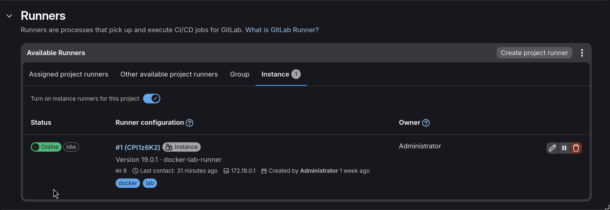
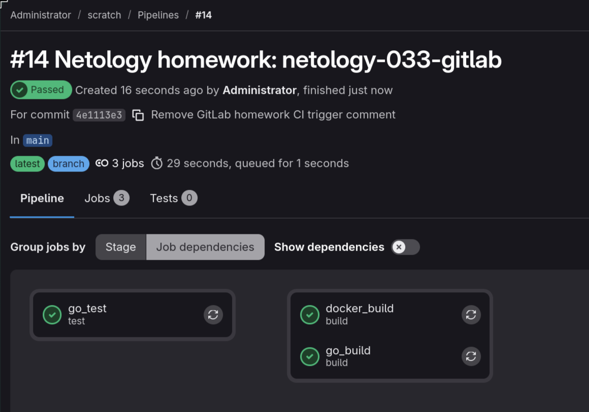

# Домашнее задание к занятию "GitLab"

Студент: Игорь Мосиичук

## О работе

GitLab и GitLab Runner были развёрнуты в локальной VM в Proxmox. Runner зарегистрирован с Docker executor и тегами `docker`, `lab`.

## Структура

```
.
├── README.md
├── .gitlab-ci.yml
├── Dockerfile
├── go.mod
├── main.go
├── main_test.go
└── docs/
    └── screenshots/
        ├── 01-runner-project-settings.png
        └── 02-pipeline-success.png
```

Основные файлы:

* [`.gitlab-ci.yml`](./.gitlab-ci.yml) - pipeline домашки;
* [`Dockerfile`](./Dockerfile) - сборка Docker-образа приложения;
* [`main.go`](./main.go), [`main_test.go`](./main_test.go) - исходный код и тест;
* [`docs/screenshots/`](./docs/screenshots/) - скриншоты проверки GitLab Runner и pipeline.

Корневой [`.gitlab-ci.yml`](../.gitlab-ci.yml) репозитория подключает pipeline домашки через `include`.

## Задание 1

<details>
<summary>Условие</summary>

Что нужно сделать:

```
Разверните GitLab локально, используя Vagrantfile и инструкцию, описанные в этом репозитории.
Создайте новый проект и пустой репозиторий в нём.
Зарегистрируйте gitlab-runner для этого проекта и запустите его в режиме Docker. Раннер можно регистрировать и запускать на той же виртуальной машине, на которой запущен GitLab.
```

В качестве ответа в репозиторий шаблона с решением добавьте скриншоты с настройками раннера в проекте.

</details>

### Решение

Vagrant не использовался, так как рабочий GitLab уже был поднят отдельно.

Runner:

* работает через Docker executor;
* доступен проекту;
* имеет теги `docker`, `lab`;
* умеет запускать job-контейнеры;
* для Docker build использует Docker socket.

Скриншот:



## Задания 2 и 3*

<details>
<summary>Условие</summary>

Что нужно сделать:

```
Запушьте репозиторий на GitLab, изменив origin. Это изучалось на занятии по Git.
Создайте .gitlab-ci.yml, описав в нём все необходимые, на ваш взгляд, этапы.
```

В качестве ответа в шаблон с решением добавьте:

```
файл gitlab-ci.yml для своего проекта или вставьте код в соответствующее поле в шаблоне;
скриншоты с успешно собранными сборками.
```

Измените CI так, чтобы:

```
этап сборки запускался сразу, не дожидаясь результатов тестов;
тесты запускались только при изменении файлов с расширением *.go.
```

В качестве ответа добавьте в шаблон с решением файл gitlab-ci.yml своего проекта или вставьте код в соответствующее поле в шаблоне.

</details>

### Решение

Сразу делал решение со звёздочкой. Подготовлен pipeline со стадиями:

* `test`;
* `build`.

Jobs:

* `go_test` - запускает тесты Go;
* `go_build` - собирает бинарник и сохраняет artifact;
* `docker_build` - собирает Docker image.

Особенности pipeline:

* `go_test` запускается только при изменении `*.go`;
* build jobs запускаются независимо через `needs: []`;
* образы и пути вынесены в переменные;
* Docker image tag собирается из переменных GitLab CI.

### Файлы

* [`.gitlab-ci.yml`](./.gitlab-ci.yml)
* [`Dockerfile`](./Dockerfile)
* [`go.mod`](./go.mod)
* [`main.go`](./main.go)
* [`main_test.go`](./main_test.go)

Результат:

```
Тесты проходят
Бинарник собирается
Docker image собирается без ошибок
```

Скриншот:


